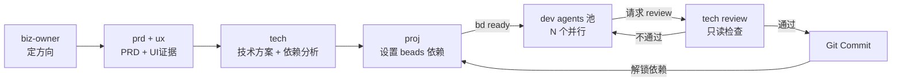

# Vibedev Agents 工作流

> **无限 AI Dev 并行调度系统**：人格化子 Agent + 文档驱动 + beads 任务管理

本仓库提供一套支持**多 AI Dev 并行开发**的交付工作流。通过 **proj 调度中心 + beads 依赖管理**，实现任务自动排队、按依赖顺序启动，最大化并行效率。

---

## 核心工作流：无限 AI Dev 并行调度

### 工作流程图



### 标准流程

#### Phase 1: 规划阶段（串行）

```bash
# 1. 定方向
使用 biz-owner agent，帮我梳理这个想法：...

# 2. 写 PRD + UI 证据
使用 prd agent，基于 biz-overview 写 PRD v0 和厚 Story
使用 ux agent，生成可运行的 HTML 原型

# 3. 技术方案
使用 tech agent，读取 PRD/Story/Slice，产出：
- TECH-{{EPIC_ID}}-v1.md（技术方案、接口契约）
- 任务依赖分析表（硬依赖 vs 接口依赖）
- TASK-*.md 文档（tech 创建）

# 4. 设置 beads 依赖
使用 proj agent，基于 TECH 的依赖分析：
- 硬依赖：执行 bd dep add <被阻塞任务> <阻塞源>
- 接口依赖：不设置依赖（契约先行）
- 输出：PROJ-{{EPIC_ID}}-v1.md
```

#### Phase 2: 开发阶段（并行）

```bash
# 批量创建 beads 任务（一次性）
/vibedevteam:init

# 启动多个 dev agent（并行）
# 每个 dev 自动执行：
TASK_ID=$(bd ready | head -1)  # 获取可启动任务
bd update $TASK_ID -s "doing"
# ... 开发 ...
# 请求 tech review
# review 通过后执行 Git Commit
# 标记为 DONE
```

**并行效果**：
- **第一批**：无硬依赖的任务（立即可并行）
- **第二批**：硬依赖上游完成后自动解锁
- **接口依赖**：契约先行，无需等待

#### Phase 3: 验收阶段

```bash
# 同步状态到 PROJ 文档
/vibedevteam:sync

# 生成依赖可视化图
/vibedevteam:graph
```

### 关键概念

#### 依赖类型

| 类型 | 定义 | beads 处理 | 并行策略 |
|-----|------|-----------|---------|
| **硬依赖** | 代码直接 import 其他任务模块 | 设置 `bd dep add` | 必须等待 |
| **接口依赖** | 只需要接口契约 | 不设置依赖 | 契约先行 |

#### 提交流程（生命线）

```
1. 完成代码 + 文档
2. 标记 beads DOING，请求 tech review
3. ⛔ 绝对不要 commit！
4. 等待 review 通过
5. 执行 Git Commit（引用 TASK ID）
6. 标记 beads DONE
```

**违反后果**：代码需重新 review、可能返工、不符合 DoD

---

## 快速导航

| 文档 | 用途 |
|------|------|
| `docs/lib/workflow-overview.md` | 工作流规范（Gate 机制、Phase 分工） |
| `docs/lib/templates/` | 所有模板（PRD/Story/Slice/Tech/Task/Proj） |
| `.claude/agents/*.md` | 各 Agent 的详细配置 |

---

## 安装到你的项目

### 前置条件

- 已安装 [Claude Code](https://claude.com/claude-code)
- 已安装 [beads](https://github.com/steveyegge/beads/blob/main/docs/INSTALLING.md)（任务管理工具）
- 你的项目是一个 Git 仓库

### 安装 beads

beads 是一个依赖感知的任务跟踪器，专为 AI 工作流设计。

**安装方式**（任选一种）：
- **Homebrew**：`brew install beads`
- **npm**：`npm install -g @beads/bd`
- **二进制**：从 [GitHub Releases](https://github.com/steveyegge/beads/releases) 下载

详细安装步骤请参考：[beads 官方安装指南](https://github.com/steveyegge/beads/blob/main/docs/INSTALLING.md)

### 安装步骤

```bash
# 1. 克隆本仓库
git clone https://github.com/vibedevteam/vibedevteam.git

# 2. 复制核心内容到你的项目
cp -r vibedevteam/docs 你的项目根目录/
mkdir -p 你的项目根目录/.claude
cp -r vibedevteam/.claude/agents 你的项目根目录/.claude/
cp -r vibedevteam/.claude/skills 你的项目根目录/.claude/

# 3. 可选：删除本仓库
rm -rf vibedevteam
```

### 目录结构（安装后）

```
你的项目/
  ├── .claude/
  │   ├── agents/              # 子 Agent 配置
  │   │   ├── biz-owner.md
  │   │   ├── prd.md
  │   │   ├── ux.md
  │   │   ├── tech.md
  │   │   ├── proj.md
  │   │   └── dev.md
  │   └── skills/              # 自动化 Skills
  │       ├── vibedevteam-init/    # 批量创建 beads 任务
  │       ├── vibedevteam-sync/    # 同步状态到 PROJ 文档
  │       └── vibedevteam-graph/   # 生成依赖可视化图
  └── docs/
      ├── lib/                 # 可复用基础设施
      ├── _project/            # 项目级配置
      └── E-XXX-*/             # Epic 文档
```

---

## 其他场景

### 场景一：Bug 修复（简化流程）

```bash
使用 dev agent，帮我修复这个 bug：...

# dev: 定位问题、实现修复、写测试、更新 TASK 文档
# dev: 标记 DOING，请求 tech review
# tech: review（通过/不通过）
# dev: review 通过后执行 Git Commit，标记 DONE
```

### 场景二：技术债/重构

```bash
使用 tech agent，评估这个技术债：...

# tech: 输出技术方案和 TASK 建议
# proj: 创建 TASK，设置依赖
# dev: 执行开发
```

---

## Agent 角色速查

| Agent | 职责 | 产物 | 是否可写代码 |
|-------|------|------|-------------|
| **biz-owner** | 定方向/边界 | biz-overview.md | ❌ |
| **prd** | 写 PRD/Story/Slice | PRD/Story/Slice 文档 | ❌ |
| **ux** | 做 UI 原型 | prototypes/ | ❌ |
| **tech** | 技术方案、依赖分析、创建 TASK | TECH/TASK 文档、代码 review | ❌（只读） |
| **proj** | 调度中心、设置 beads 依赖 | PROJ 文档 | ❌ |
| **dev** | 写代码、测试、更新文档 | 代码、TASK 回写 | ✅（唯一可写） |

---

## 核心概念

### Gate 机制

| Gate | 触发时机 | 检查项 |
|------|----------|--------|
| **Gate A** | 进入 PRD v1 前 | 目标/范围/非目标能复述，有止损信号 |
| **Gate B** | 进入实现前 | UI 证据存在，"方向对了" |
| **Gate C** | 允许拆 TASK | 至少 1 个厚 STORY + 1 份 SLICE |

### TDD 规则

- **P0/P1**：默认先写测试再写实现
- **测试基建**：前端 Vitest/Jest，后端 testify，覆盖率目标 70%
- **禁止 mock**：开发阶段禁止使用 mock 数据或假接口
- **真数据验证**：必须包含"真数据真流程"（P0/P1 强制）

### beads 任务状态管理

- **状态真实源**：所有任务状态以 beads 为准，TASK 文档只回写证据
- **自动调度**：`bd ready` 自动返回可启动任务（无阻塞）
- **依赖管理**：
  - 硬依赖：`bd dep add <被阻塞> <阻塞源>`
  - 接口依赖：不设置，契约先行

### 自动化 Skills

| Skill | 用途 |
|-------|------|
| `/vibedevteam:init` | 批量创建 beads 任务并关联 TASK 文档 |
| `/vibedevteam:sync` | 同步 beads 状态到 PROJ 文档 |
| `/vibedevteam:graph` | 生成任务依赖可视化图 |

---

## 从零开始创建 Epic

```bash
你: 使用 prd agent，帮我创建一个新 Epic E-001：...

prd: 好的，我先问几个问题...
[多轮对话，澄清需求、边界、主路径]

prd: 我现在创建 docs/E-001-xxx/ 目录并生成 PRD v0、Story、Slice 文档
```

**检查清单**：
- [ ] `docs/E-XXX-*/` 目录已创建
- [ ] PRD v0 有 UI 证据链接
- [ ] 至少 1 个厚 STORY（主路径/状态机/AC）
- [ ] 至少 1 份 SLICE-001（闭环定义）
- [ ] 每个 TASK 能追溯到 STORY_ID + SLICE_ID

---

## 贡献规范

- 修改 `docs/lib/templates/` 时，同步更新 `docs/lib/template-mapping.md`
- 新增 Epic 请放到 `docs/E-XXX-*/`，不要直接改基础模板
