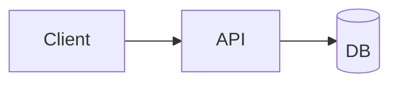

# TECH Epic Template（TECH-{{EPIC_ID}}-v{{N}}）

> 建议文件路径：
> `/docs/{{EPIC_DIR}}/tech/TECH-{{EPIC_ID}}-v{{N}}.md`
>
> 目标：把 “PRD/Story 里要做什么” 翻译成 “在现有代码基线下怎么做”，并且显式写出「复用点/改动点/迁移与上线策略/风险与任务拆解」。

---

## 0. 文档元信息

- EPIC_ID：`{{EPIC_ID}}`
- EPIC_DIR：`{{EPIC_DIR}}`
- 版本：`v{{N}}`
- 状态：`DRAFT | REVIEW | FINAL`
- 作者：`{{OWNER}}`
- 关联文档：
  - biz：`/docs/_project/biz-overview.md`
  - prd：`../prd/PRD-{{EPIC_ID}}-v{{N}}.md`
  - story：`../story/`（列出本期纳入的 Story）
  - project baseline：`/docs/_project/`（列出你依赖的基线/规范/ADR）

---

## 1. 目标与范围对齐（引用上游，不重写）

- 目标（来自 biz/prd）：`...`
- Out of Scope（来自 biz/prd）：`...`
- 验收口径摘要（来自 Story AC）：`...`
- 需求层可观测性摘要（来自 prd）：`...`

---

## 2. 现状与约束（必须先读代码）

### 2.1 相关代码/系统现状

- 相关模块/服务：`...`
- 关键入口/调用链：`...`
- 关键数据表/索引：`...`
- 关键配置/Feature Flag：`...`

### 2.2 复用清单（避免重复造轮子）

> 写清楚“能复用什么、怎么复用、为什么不复用”。

- 可复用能力/组件：`...`
- 需要扩展的既有能力：`...`
- 不复用的理由（如适用）：`...`

### 2.3 硬约束

- 技术基线约束：`...`
- 合规/权限/审计约束：`...`
- 交付约束（时间/风险/依赖）：`...`

---

## 3. 方案总览（1 页能讲清）

- 方案一句话：`...`
- 架构变化概览：`...`
- 关键 trade-off：`...`
- 影响面：`...`

（可选）架构图（Mermaid/ASCII）：

---

## 4. 详细设计

### 4.1 模块/服务边界与职责

- `...`

### 4.2 数据模型与迁移策略

- 表/字段/索引：`...`
- 迁移步骤：`...`
- 兼容策略：`...`

### 4.3 API / 事件 / 任务设计

- API 列表与契约：`...`
- 事件/消息：`...`
- 异步/定时任务：`...`

### 4.4 安全 / 权限 / 审计

- 权限模型与校验点：`...`
- 审计日志：`...`

### 4.5 可观测性（工程侧）

> 把 prd 的需求层可观测性口径落到工程实现：日志、指标、tracing、报表管道与告警。

- 日志：`...`
- 指标：`...`
- Tracing：`...`
- 仪表盘/告警：`...`

### 4.6 失败模式与可靠性

- 幂等/重试：`...`
- 降级/兜底：`...`
- 限流/熔断：`...`

---

## 5. 上线策略（MVP→演进）

- Feature Flag / 灰度：`...`
- 回滚策略：`...`
- 数据回填/重算：`...`
- 兼容期策略：`...`

---

## 6. 风险、未决项与升级点

- `[RISK]`：`...`
- `[OPEN]`：`...`
- `[TBD]`：`...`
- 需要升级给：
  - `prd`：`...`
  - `biz-owner`：`...`
  - `proj`：`...`

---

## 7. 任务拆解建议（供 proj/dev 落 TASK）

> 输出顺序：先打通主链路，再补齐边界与质量；标出依赖关系与可以并行的项。

- 建议任务列表：
  - `TASK-001`：`...`（依赖：...）
  - `TASK-002`：`...`

---

## 8. 与基线冲突（如有）

> 用 `[CONFLICT_WITH_BASELINE]` 标注，并给出 ADR 草案要点。

- `[CONFLICT_WITH_BASELINE]`：`...`
- ADR 草案要点：`...`
